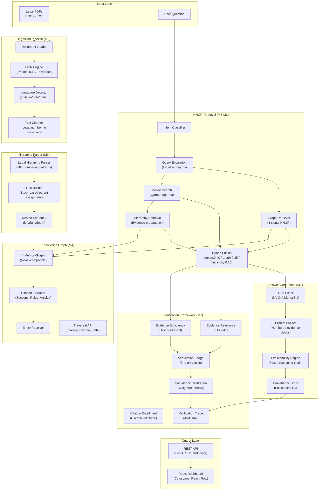
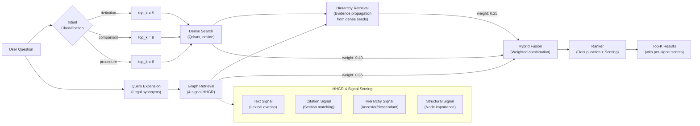
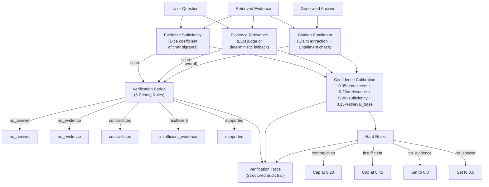
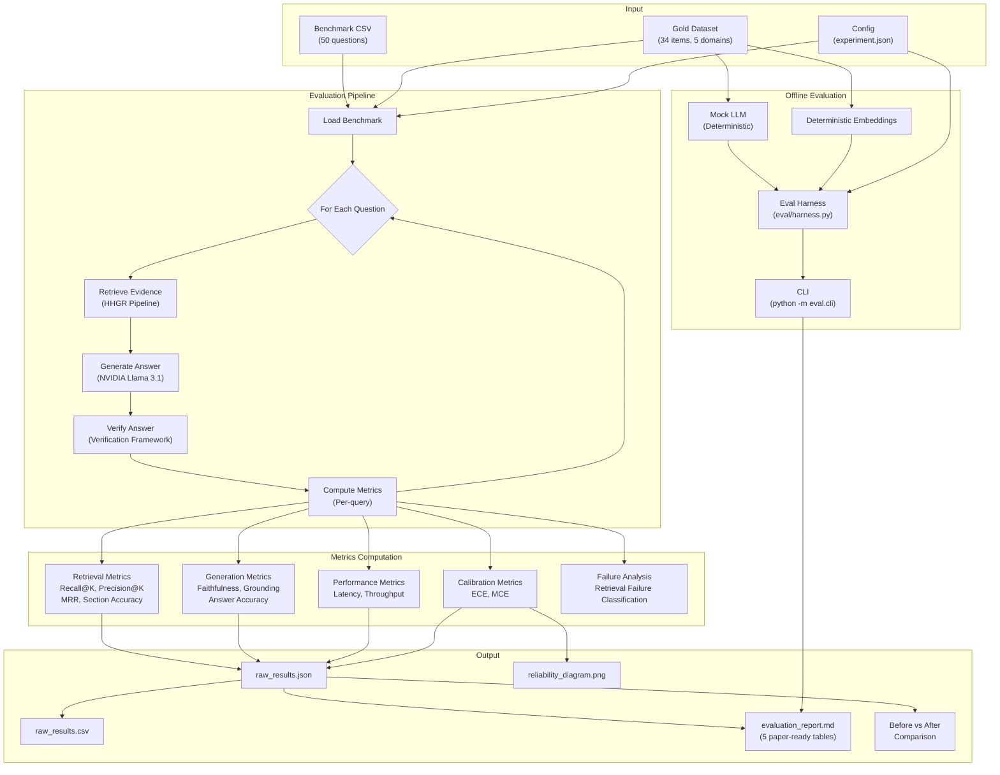

# Architecture Diagrams

Mermaid diagrams for the HHGR system architecture.

## 1. Overall System Architecture

```mermaid
graph TB
    subgraph Input["Input Layer"]
        PDF["Legal PDFs<br/>DOCX / TXT"]
        Q["User Question"]
    end

    subgraph Ingestion["Ingestion Pipeline (M2)"]
        Loader["Document Loader"]
        OCR["OCR Engine<br/>(PaddleOCR / Tesseract)"]
        Lang["Language Detector<br/>(en/hi/kn/ta/te/ml/bn)"]
        Clean["Text Cleaner<br/>(Legal numbering preserved)"]
    end

    subgraph Hierarchy["Hierarchy Parser (M3)"]
        Parser["Legal Hierarchy Parser<br/>(20+ numbering patterns)"]
        Tree["Tree Builder<br/>(Stack-based parent assignment)"]
        NSI["Nested Set Index<br/>(left/right/depth)"]
    end

    subgraph KG["Knowledge Graph (M4)"]
        Graph["InMemoryGraph<br/>(Neo4j-compatible)"]
        Citations["Citation Extractor<br/>(Sections, Rules, Articles)"]
        Resolver["Entity Resolver"]
        Traversal["Traversal API<br/>(parents, children, paths)"]
    end

    subgraph Retrieval["HHGR Retrieval (M5-M6)"]
        Intent["Intent Classifier"]
        Query["Query Expansion<br/>(Legal synonyms)"]
        Dense["Dense Search<br/>(Qdrant, bge-m3)"]
        GraphRet["Graph Retrieval<br/>(4-signal HHGR)"]
        HierarchyRet["Hierarchy Retrieval<br/>(Evidence propagation)"]
        Fusion["Hybrid Fusion<br/>(dense:0.40 / graph:0.35 / hierarchy:0.25)"]
    end

    subgraph Verification["Verification Framework (M7)"]
        Suff["Evidence Sufficiency<br/>(Dice coefficient)"]
        Rel["Evidence Relevance<br/>(LLM judge)"]
        Entail["Citation Entailment<br/>(Claim-level check)"]
        Badge["Verification Badge<br/>(5-priority rules)"]
        Conf["Confidence Calibration<br/>(Weighted formula)"]
        Trace["Verification Trace<br/>(Audit trail)"]
    end

    subgraph Generation["Answer Generation (M7)"]
        LLM["LLM Client<br/>(NVIDIA Llama 3.1)"]
        Prompt["Prompt Builder<br/>(Numbered evidence blocks)"]
        Explain["Explainability Engine<br/>(6-step reasoning chain)"]
        Prov["Provenance Store<br/>(Full auditability)"]
    end

    subgraph Output["Output Layer"]
        API["REST API<br/>(FastAPI, 11 endpoints)"]
        UI["React Dashboard<br/>(Cytoscape, React Flow)"]
    end

    PDF --> Loader
    Loader --> OCR
    OCR --> Lang
    Lang --> Clean
    Clean --> Parser
    Parser --> Tree
    Tree --> NSI
    NSI --> Graph
    Graph --> Citations
    Citations --> Resolver

    Q --> Intent
    Intent --> Query
    Query --> Dense
    Query --> GraphRet
    GraphRet --> Graph
    Dense --> HierarchyRet
    HierarchyRet --> Graph
    Dense --> Fusion
    GraphRet --> Fusion
    HierarchyRet --> Fusion

    Fusion --> Suff
    Fusion --> Rel
    Suff --> Badge
    Rel --> Badge
    Badge --> Conf
    Conf --> Trace

    Fusion --> LLM
    LLM --> Prompt
    Prompt --> Explain
    Explain --> Prov
    Prov --> Trace

    Trace --> API
    API --> UI
```

## 2. Retrieval Pipeline

```mermaid
flowchart LR
    Q["User Question"]

    Q --> Intent{"Intent<br/>Classification"}

    Intent -->|"definition"| TopK["top_k = 5"]
    Intent -->|"comparison"| TopK3["top_k = 8"]
    Intent -->|"procedure"| TopK4["top_k = 6"]

    TopK --> Dense["Dense Search<br/>(Qdrant, cosine)"]
    TopK3 --> Dense
    TopK4 --> Dense

    Q --> Expand["Query Expansion<br/>(Legal synonyms)"]
    Expand --> GraphRet["Graph Retrieval<br/>(4-signal HHGR)"]

    Dense --> Hierarchy["Hierarchy Retrieval<br/>(Evidence propagation<br/>from dense seeds)"]
    GraphRet --> Hierarchy

    Dense -->|"weight: 0.40"| Fusion["Hybrid Fusion<br/>(Weighted combination)"]
    GraphRet -->|"weight: 0.35"| Fusion
    Hierarchy -->|"weight: 0.25"| Fusion

    Fusion --> Rank["Ranker<br/>(Deduplication + Scoring)"]
    Rank --> Results["Top-K Results<br/>(with per-signal scores)"]

    subgraph Signals["HHGR 4-Signal Scoring"]
        Text["Text Signal<br/>(Lexical overlap)"]
        Cite["Citation Signal<br/>(Section matching)"]
        Hier["Hierarchy Signal<br/>(Ancestor/descendant)"]
        Struct["Structural Signal<br/>(Node importance)"]
    end

    GraphRet -.-> Signals
```

## 3. Verification Pipeline

```mermaid
flowchart TB
    E["Retrieved Evidence"]
    A["Generated Answer"]
    Q["User Question"]

    Q --> Suff["Evidence Sufficiency<br/>(Dice coefficient<br/>of char bigrams)"]
    E --> Suff

    Q --> Rel["Evidence Relevance<br/>(LLM judge or<br/>deterministic fallback)"]
    E --> Rel

    E --> Entail["Citation Entailment<br/>(Claim extraction →<br/>Entailment check)"]
    A --> Entail

    Suff -->|"score"| Badge["Verification Badge<br/>(5 Priority Rules)"]
    Rel -->|"score"| Badge
    Entail -->|"overall"| Badge

    Badge -->|"no_answer"| B1["no_answer"]
    Badge -->|"no_evidence"| B2["no_evidence"]
    Badge -->|"contradicted"| B3["contradicted"]
    Badge -->|"insufficient"| B4["insufficient_evidence"]
    Badge -->|"supported"| B5["supported"]

    Suff --> Conf["Confidence Calibration<br/>0.35×entailment +<br/>0.30×relevance +<br/>0.20×sufficiency +<br/>0.15×retrieval_base"]
    Rel --> Conf
    Entail --> Conf

    Conf --> Hard["Hard Rules"]
    Hard -->|"contradiction"| Cap1["Cap at 0.20"]
    Hard -->|"insufficient"| Cap2["Cap at 0.45"]
    Hard -->|"no_evidence"| Cap3["Set to 0.0"]
    Hard -->|"no_answer"| Cap4["Set to 0.0"]

    Badge --> Trace["Verification Trace<br/>(Structured audit trail)"]
    Conf --> Trace
    Hard --> Trace
```

## 4. Evaluation Pipeline

```mermaid
flowchart TB
    subgraph Input["Input"]
        CSV["Benchmark CSV<br/>(50 questions)"]
        Gold["Gold Dataset<br/>(34 items, 5 domains)"]
        Config["Config<br/>(experiment.json)"]
    end

    subgraph Pipeline["Evaluation Pipeline"]
        Load["Load Benchmark"]
        ForEach{"For Each Question"}

        ForEach --> Ret["Retrieve Evidence<br/>(HHGR Pipeline)"]
        Ret --> Gen["Generate Answer<br/>(NVIDIA Llama 3.1)"]
        Gen --> Verify["Verify Answer<br/>(Verification Framework)"]
        Verify --> Metrics["Compute Metrics<br/>(Per-query)"]
        Metrics --> ForEach
    end

    subgraph Metrics2["Metrics Computation"]
        RM["Retrieval Metrics<br/>Recall@K, Precision@K<br/>MRR, Section Accuracy"]
        GM["Generation Metrics<br/>Faithfulness, Grounding<br/>Answer Accuracy"]
        PM["Performance Metrics<br/>Latency, Throughput"]
        CM["Calibration Metrics<br/>ECE, MCE"]
        FR["Failure Analysis<br/>Retrieval Failure Classification"]
    end

    subgraph Output["Output"]
        JSON["raw_results.json"]
        CSV2["raw_results.csv"]
        Report["evaluation_report.md<br/>(5 paper-ready tables)"]
        Plot["reliability_diagram.png"]
        Compare["Before vs After<br/>Comparison"]
    end

    subgraph Compare2["Offline Evaluation"]
        Mock["Mock LLM<br/>(Deterministic)"]
        Det["Deterministic Embeddings"]
        Harness["Eval Harness<br/>(eval/harness.py)"]
        CLI["CLI<br/>(python -m eval.cli)"]
    end

    CSV --> Load
    Gold --> Load
    Config --> Load
    Load --> ForEach

    Metrics --> RM
    Metrics --> GM
    Metrics --> PM
    Metrics --> CM
    Metrics --> FR

    RM --> JSON
    GM --> JSON
    PM --> JSON
    CM --> JSON
    JSON --> Report
    JSON --> CSV2
    CM --> Plot
    JSON --> Compare

    Gold --> Mock
    Gold --> Det
    Mock --> Harness
    Det --> Harness
    Config --> Harness
    Harness --> CLI
    CLI --> Report
```
